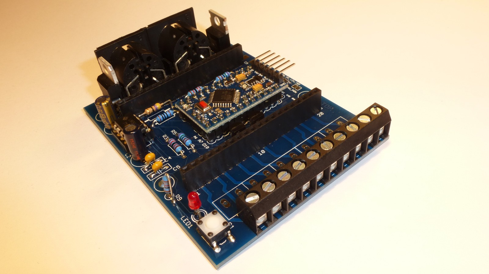

# Basisplatine 2.0 mit DIN Buchsen

siehe <a href="http://opensx.net/projekte/basisplatine/neue-version-v02-00/"> OpenSX Basisplatine Version 2.00 mit DIN Buchsen</a> - hierzu muss die Arduino Lib SX30 verwendet werden, siehe  <a href="https://github.com/opensx/SX30/"> SX Library mit Beispiel "Belegtmelder" </a>.

Auf die Basisplatine kann zB eine Belegtmelderplatine aufgesetzt werden:

 This work is licensed under a <a rel="license" href="http://creativecommons.org/licenses/by-sa/4.0/">Creative Commons Attribution-ShareAlike 4.0 International License</a>.
