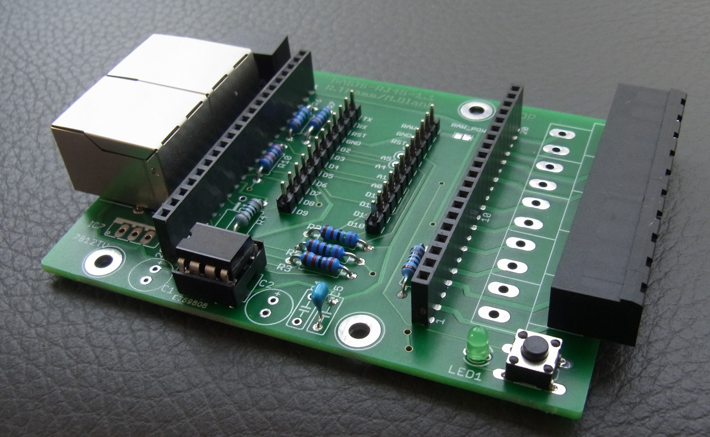

# Basisplatine mit RJ45 Buchsen

Design Files für die <a href="http://http://opensx.net/projekte/basisplatine/rj45/"> OpenSX Basisplatine mit RJ45 Buchsen</a> - mehr dazu bei <a href="http://http://opensx.net/projekte/basisplatine/rj45/"> OpenSX.net</a> 

 This work is licensed under a <a rel="license" href="http://creativecommons.org/licenses/by-sa/4.0/">Creative Commons Attribution-ShareAlike 4.0 International License</a>.
