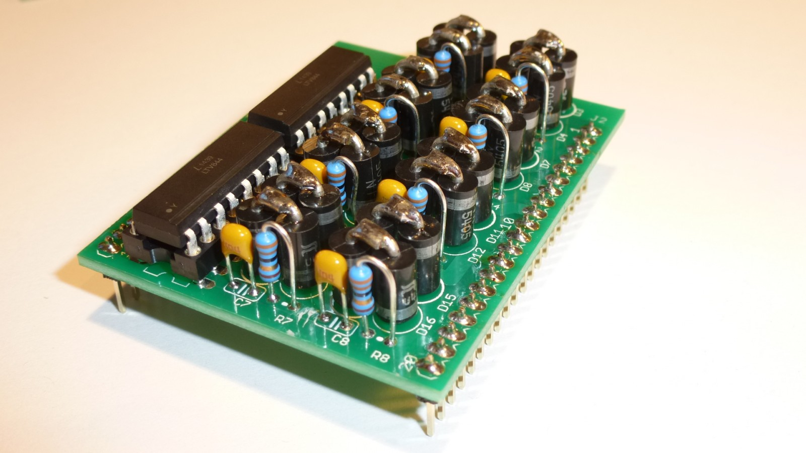

# Belegtmelder 1.0 Aufsatzplatine

siehe <a href="http://opensx.net/projekte/belegtmelder/"> OpenSX Belegtmelder-Aufsatzplatine</a> - die Dioden 1N5405 werden nur einseitig auf der Platine angelötet, um Platz zu sparen. Die andere Seite ist jeweils an eine in Reihe geschaltete Diode angelötet! 2 dieser "Päarchen" werden antiparallel nebeneinander geschaltet, um den Spannungsabfall auf +/- 1.4 zu begrenzen. Mit dieser Spannung können die Optokoppler LTV844 betrieben werden. Die Arduino Software sorgt dann noch für Filterung und für die Weitergabe an den SX Bus.

Auf der Basisplatine wird NUR EINE REIHE Klemmen verwendet, eine der beiden linken Klemmen dient der Stromzuführung von der SX-Zentrale , an den anderen 8 wird der entsprechende Pol der Gleise angeschlossen. Der zweite Zentralenanschluss wird direkt mit den Gleisen verbunden.

  (siehe auch das größere Foto wegen des Doppeldioden-Aufbaus)

Schaltplan: siehe pdf.

Modul-Gehäuse: Strapubox 524 (das ist die etwas höhere Version) (siehe strapubox.de)

Fotos und HW Design: R. Thamm.

 This work is licensed under a <a rel="license" href="http://creativecommons.org/licenses/by-sa/4.0/">Creative Commons Attribution-ShareAlike 4.0 International License</a>.
