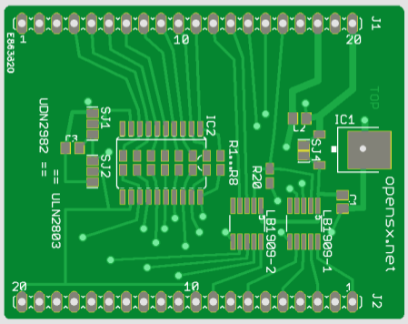

# Weichen(Tortoise) und Signal Treiber Add-on Platine für die Basisplatine

Design Files für die <a href="http://http://opensx.net/projekte/rt-weiche-signal-1.0/"> OpenSX Addon-Platine fuer Weichen/Signal Ansteuerung</a> - mehr dazu bei <a href="http://http://opensx.net/"> OpenSX.net</a> 

Sie ermöglicht das Ansteuern von 4 Tortoise Antrieben (LB1909MC Treiber) und 2 Lichtsignalen mit je 4 Begriffen, entweder 12/15V mit gemeinsame Anode (ULN2803 Treiber) oder mit gemeinsamer Kathode (UDN2982 Treiber) oder direkt als LED Treiber mit 8 Vorwiderständen.

 This work is licensed under a <a rel="license" href="http://creativecommons.org/licenses/by-sa/4.0/">Creative Commons Attribution-ShareAlike 4.0 International License</a>.
