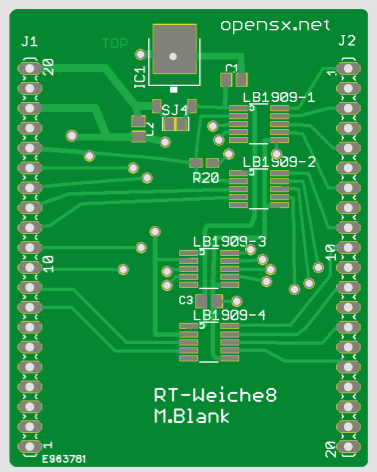

# Weichen-Ansteuerungs Add-on Platine für die Basisplatine "RT-Weiche8"

Sie ermöglicht das Ansteuern von 8 Tortoise Antrieben (mit LB1909MC Treibern).

Für die Weichenmotoren ist eine separate Spannung vorgesehen (IC1), sie kann zum Beispiel 9V oder 12V betragen.

Modul-Gehäuse: Strapubox 523 (strapubox.de)

 This work is licensed under a <a rel="license" href="http://creativecommons.org/licenses/by-sa/4.0/">Creative Commons Attribution-ShareAlike 4.0 International License</a>.
